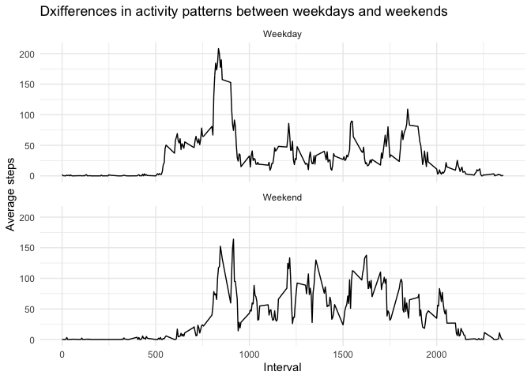

## Loading and preprocessing the data


```r
library(readr)
library(dplyr)
library(lubridate)
library(ggplot2)
```


```r
df <- read_csv("./data/activity.csv", col_types = cols(steps = col_number(), 
        date = col_date(format = "%Y-%m-%d"), 
        interval = col_number()))
summary(df)
```

```
##      steps             date               interval     
##  Min.   :  0.00   Min.   :2012-10-01   Min.   :   0.0  
##  1st Qu.:  0.00   1st Qu.:2012-10-16   1st Qu.: 588.8  
##  Median :  0.00   Median :2012-10-31   Median :1177.5  
##  Mean   : 37.38   Mean   :2012-10-31   Mean   :1177.5  
##  3rd Qu.: 12.00   3rd Qu.:2012-11-15   3rd Qu.:1766.2  
##  Max.   :806.00   Max.   :2012-11-30   Max.   :2355.0  
##  NA's   :2304
```

## What is mean total number of steps taken per day?


```r
steps_per_days = with(na.omit(df), tapply(steps, date, sum))
avg = mean(steps_per_days, na.rm = T)
med = median(steps_per_days, na.rm = T)
    
hist(steps_per_days, xlab="Steps", main="",breaks = 10)
abline(v = avg, col = "blue", lwd = 2)
```

<!-- -->


```r
avg
```

```
## [1] 10766.19
```

```r
med
```

```
## [1] 10765
```

## What is the average daily activity pattern?


```r
df_avg_day <- na.omit(df) %>% group_by(interval) %>% summarise(avg_steps=mean(steps))

ggplot(data=df_avg_day, aes(x=interval,y=avg_steps)) + geom_line() + theme_minimal() + labs(y="Average steps",x="Interval", title="Average daily activity pattern")
```

<!-- -->

```r
maxed = df_avg_day[which.max(df_avg_day$avg_steps),]
```

Maximum avg steps = __206.1698113__ @interval __835__
    

## Imputing missing values

Missing values for steps: __2304__

### Strategy

Interval is numeric presentation of time: 2355 eq 23:55<br />
Instead of imputing the average daily steps (which seems most obvious),<br />
impute na(steps) on the median of the steps taken at the interval for a given day of week

_example: median of monday @ 10:55 = 36 = imputed_value_


```r
#take median of steps at dayofweek@interval, ignoring NA 
df$wd = wday(df$date)
steps_interval <- na.omit(df) %>% group_by(wd,interval) %>% summarise(msteps=median(steps))
#merge with original frame where steps are NA
m_df <- merge(df[ is.na(df$steps),],steps_interval, by=c("wd","interval"))

# replace steps with values, and drop intermediate by copying only col-names from org. df
m_df$steps <- m_df$msteps
m_df <- m_df[, names(df)]

#reconstruct df dropping NA's and merging with imputed
df <- rbind(na.omit(df),m_df)
```


```r
steps_per_days = with(na.omit(df), tapply(steps, date, sum))
avg = mean(steps_per_days, na.rm = T)
med = median(steps_per_days, na.rm = T)
    
hist(steps_per_days, xlab="Steps", main="",breaks = 10)
abline(v = avg, col = "blue", lwd = 2)
abline(v = med, col = "green", lwd = 2)
```

<!-- -->


```r
avg
```

```
## [1] 9705.238
```

```r
med
```

```
## [1] 10395
```

## Are there differences in activity patterns between weekdays and weekends?


```r
df$isweekend = ifelse(df$wd == 7 | df$wd == 1, "Weekend","Weekday")
dfw <- df %>% group_by(isweekend,interval) %>% summarise(steps=mean(steps))

ggplot(data=dfw, aes(x=interval,y=steps)) + geom_line() + facet_wrap(~isweekend, ncol=1) + theme_minimal() + labs(x="Interval",y="Average steps",title="Dxifferences in activity patterns between weekdays and weekends")
```

<!-- -->

